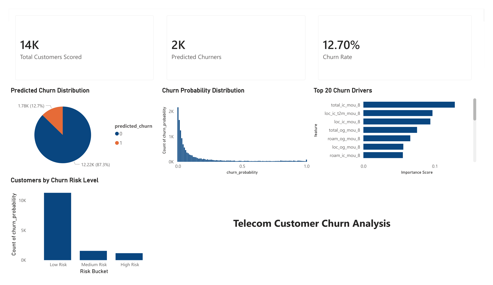

# Telecom Customer Churn Predictor

An end-to-end machine learning pipeline that predicts customer churn for a telecom provider using behavioral data across three months. Built with PySpark, scikit-learn, PyTorch, and visualized in Power BI.



---

## Problem Statement

Telecom companies lose significant revenue when customers cancel their subscriptions. This project builds a churn prediction system using customer usage patterns across June, July, and August to identify at-risk customers before they leave — enabling proactive retention campaigns.

**Dataset:** Indian Telecom Churn Dataset — 69,999 customers, 172 raw features, 10:1 class imbalance (7,132 churners vs 62,867 non-churners).

---

## Pipeline Overview

| Stage | Description | Tools |
|---|---|---|
| 1. Ingestion & Cleaning | Load raw data, drop high-null columns (>30%), impute data-usage nulls with zero | PySpark |
| 2. Feature Engineering | Engineer month-over-month delta features to capture behavioral decay | PySpark |
| 3. Preprocessing | Train/val/test split (60/20/20), standardization, SMOTE for class imbalance | scikit-learn, imbalanced-learn |
| 4. Modeling | Logistic Regression baseline, Random Forest, XGBoost, Neural Network | scikit-learn, XGBoost, PyTorch |
| 5. Evaluation | F1 score, ROC-AUC on held-out test set; RFE for feature reduction | scikit-learn |
| 6. Dashboard | Business-facing churn insights, risk buckets, top churn drivers | Power BI |

---

## Key Findings

**Behavioral decay precedes churn.** Churners show dramatically declining usage across months 6 → 7 → 8, while non-churners remain stable or grow:

| Metric | Non-Churner (month 6→8) | Churner (month 6→8) |
|---|---|---|
| ARPU | 280 → 297 | 308 → 114 |
| Total Outgoing MOU | 301 → 328 | 352 → 92 |
| Recharge Amount | 325 → 346 | 350 → 120 |

**Month 8 dominates feature importance.** 12 of the top 20 RFE-selected features are from month 8 — the final month before churn. Endpoint behavior is more predictive than rate of decline.

**Engineered delta features validated.** `arpu_trend` and `mou_trend` (month 8 minus month 6) both survived RFE selection, confirming that behavioral decay signals add predictive value beyond raw monthly features.

**High-null columns are systematic, not random.** Data-usage columns (2G/3G recharge, data volume) had 70%+ null rates — indicating a large segment of voice-only customers who never used mobile data. These were imputed with zero rather than mean/median.

---

## Model Results

### Validation Set

| Model | Precision (Churn) | Recall (Churn) | F1 (Churn) | ROC-AUC |
|---|---|---|---|---|
| Logistic Regression (baseline) | 0.32 | 0.84 | 0.46 | 0.89 |
| XGBoost | 0.68 | 0.66 | 0.67 | 0.93 |
| **Random Forest** | **0.62** | **0.72** | **0.67** | **0.93** |
| Neural Network (128→64→32, Dropout 0.3) | 0.50 | 0.76 | 0.61 | 0.91 |

### Final Test Set — Random Forest (Selected Model)

| Metric | Full Model (136 features) | RFE Model (20 features) |
|---|---|---|
| Precision (Churn) | 0.64 | 0.59 |
| Recall (Churn) | 0.71 | 0.74 |
| F1 (Churn) | 0.67 | 0.66 |
| ROC-AUC | 0.93 | 0.93 |

**Random Forest was selected** as the best model. Neural networks underperformed on this tabular dataset despite tuning — consistent with the known advantage of tree-based models on structured data.

**RFE reduced complexity by 85%** (136 → 20 features) with negligible performance loss (F1 0.66 vs 0.67, ROC-AUC identical). For production deployment where interpretability matters, the RFE model is preferred.

---

## Top 20 Churn-Driving Features (RFE)

| Rank | Feature | Importance |
|---|---|---|
| 1 | total_ic_mou_8 | 0.128 |
| 2 | loc_ic_t2m_mou_8 | 0.097 |
| 3 | loc_ic_mou_8 | 0.094 |
| 4 | total_og_mou_8 | 0.075 |
| 5 | roam_og_mou_8 | 0.066 |
| ... | ... | ... |
| 14 | arpu_trend | 0.027 |
| 16 | mou_trend | 0.027 |
| 18 | aon (Age on Network) | 0.026 |

Notable: `aon` (customer tenure) appears in the top 20 — newer customers churn at higher rates.

---

## Project Structure

```
telecom-churn-predictor/
├── data/
│   ├── train.csv                   # Raw training data
│   ├── processed_data.csv          # Cleaned, feature-engineered data
│   ├── churn_predictions.csv       # Test set predictions for Power BI
│   └── feature_importance.csv      # RFE feature importances for Power BI
├── notebooks/
│   ├── data_preprocessing.ipynb   # PySpark ingestion, cleaning, feature engineering
│   └── data_modeling.ipynb        # Preprocessing, modeling, evaluation
├── models.py                       # PyTorch ChurnPredictorNN class
├── dashboard.png                   # Power BI dashboard screenshot
├── dashboard.pdf                   # Power BI dashboard export
└── README.md
```

---

## Setup & Installation

```bash
git clone https://github.com/shadowfiend745/telecom_churn_predictor
cd telecom-churn-predictor
pip install -r requirements.txt
```
**Data:** Download the telecom churn dataset from Kaggle:
https://www.kaggle.com/datasets/pragya2611/mltelecomchurn
Place train.csv in the data/ folder before running notebooks.

**Requirements:**
```
pyspark
pandas
numpy
scikit-learn
imbalanced-learn
xgboost
torch
matplotlib
```

**Java 11 is required for PySpark.** Download from https://adoptium.net

Run notebooks in order:
1. `data_preprocessing.ipynb` — generates `processed_data.csv`
2. `data_modeling.ipynb` — generates model results and `churn_predictions.csv`

---

## Business Applicability

The techniques used in this project transfer directly to financial services:

- Imbalanced classification → fraud detection
- Behavioral trend features → transaction pattern anomalies
- Customer segmentation by risk bucket → credit risk tiering
- RFE feature selection → regulatory model interpretability requirements

---

## Tools & Technologies

Python · PySpark · scikit-learn · PyTorch · XGBoost · imbalanced-learn · Pandas · Power BI · Git